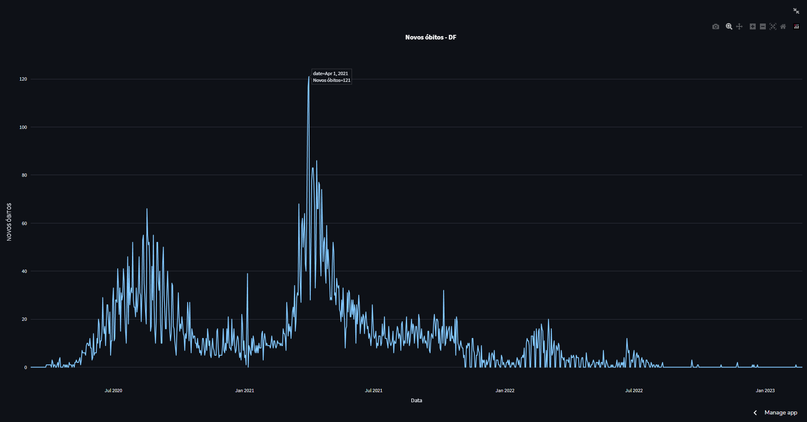

    <h1>Gráficos interativos da Covid-19 no Brasil</h1>

  

## Sobre

Compartilhando gráficos interativos da Covid-19 com Streamlit

## Tecnologias utilizadas

* streamlit 1.16.0
* plotly 5.8.0

## Link da aplicação

[davirsreis-graficos-covid-graficos-covid-ld11xa.streamlit.app](https://davirsreis-graficos-covid-graficos-covid-ld11xa.streamlit.app/)

## Para executar

1. `git clone https://github.com/davirsreis/graficos-covid.git`
2. `cd graficos-covid`
3. `streamlit run graficos-covid.py`

## Instruções

1. Acesse o link ou inicie a aplicação
2. Escolha o estado e o tipo de informação que deseja visualizar na barra lateral

Após isso, o gráfico é atualizado automaticamente

É possível visualizar as informações com maior precisão posicionando o cursor sobre a linha na data que deseje visualizar.

